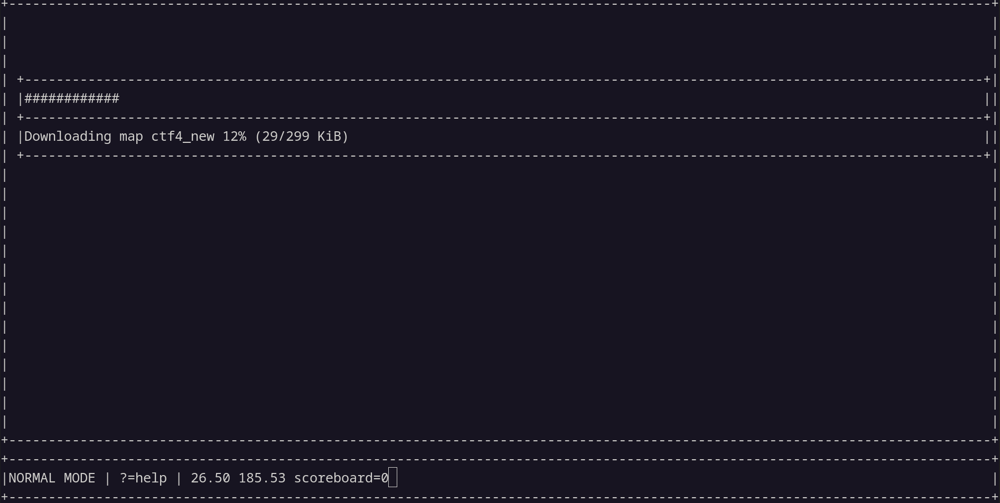
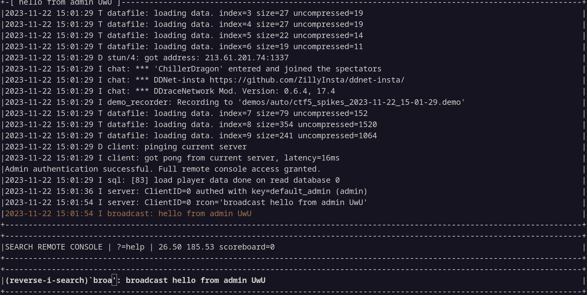
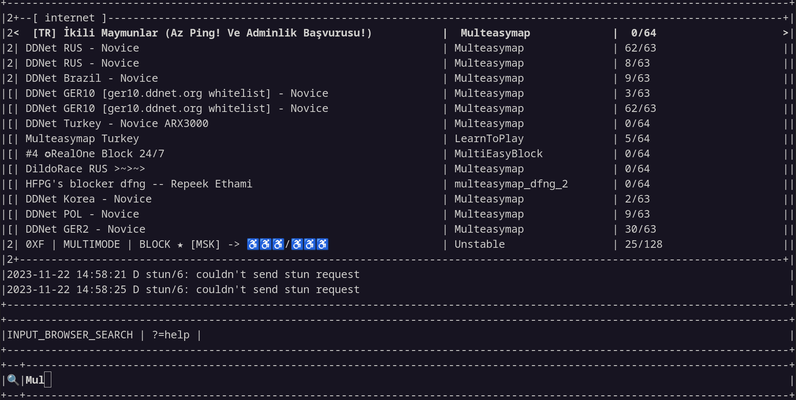
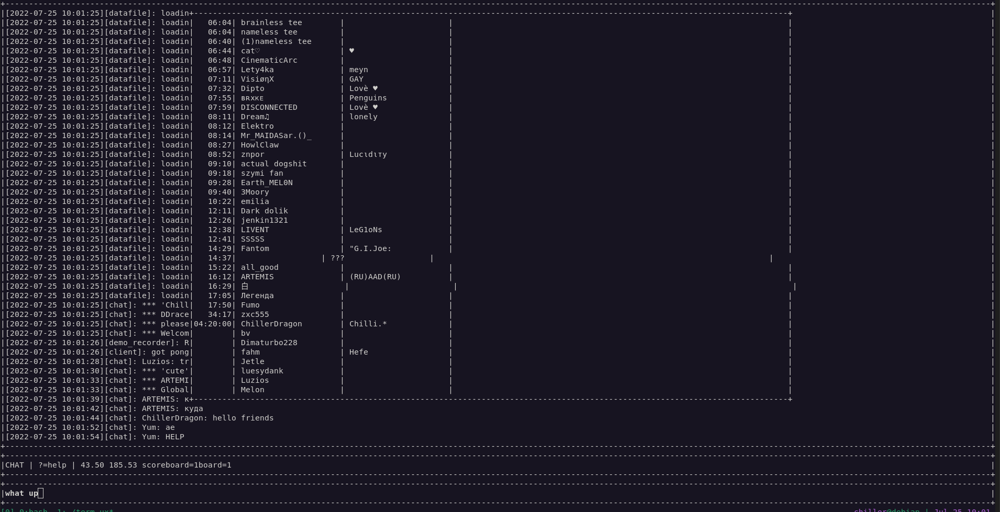
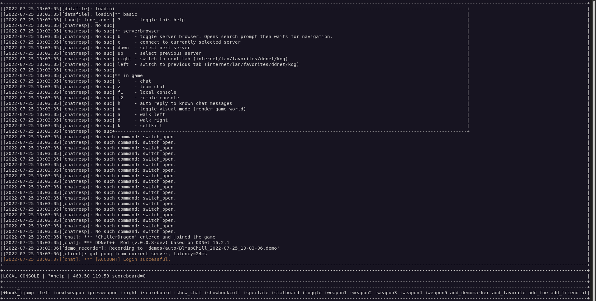

# ChillerBot User Xp


Made for main client usage. Based on DDNet which is based on DDrace which is based on Teeworlds.

Features
--------

### Password manager

Go to your teeworlds/chillerbot directory and create the file ``chillpw_secret.txt``


Format is ``hostname:port,dummy,command``
* hostname:port
    - server ip and port
* dummy
    - 0 for main tee 1 for dummy
* command
    - local console command to execute

example:

~/.teeworlds/chillerbot/chillpw_secret.txt
```
# this is a comment
51.210.171.47:7303,0,say /login ChillerDragon password
51.210.171.47:7303,1,say /login ChillerDragon2 password2

# you can also omit the port like this
# it will try to login on all ports if the ip matches 51.210.171.47
# BUT BE CAREFUL!
# this might leak your password in shared hosting scenarios
# or might even send it to public chat if one hoster also has vanilla servers
# only omit the port if you know what you are doing
51.210.171.47,0,say /login ChillerDragon password
51.210.171.47,1,say /login ChillerDragon2 password2
```

### Render pictures

if ``cl_render_pic`` is set to ``1`` it renders images found in the ``playerpics/`` directory above the tees if their ingame name matches the image name.

### Rename on finish

if ``cl_finish_rename`` is set to ``1`` the client will automatically rename the player if a finish tile is near by.
The name is changed to ``cl_finish_name``.


### Spectate switch and tele tiles

In ddrace maps you can go to spectators or do /pause and then execute ``goto_switch i[number]`` to set your view to the first switcher with this number. Execute it again to view the next. Or provide a second argument to view a specific occurence at offset x. For example to find the 2nd switcher with the number 12 do:

    goto_switch 12 2

To iterate over all teleporters with number 3 (in, out, evil, weapons)

    goto_tele 3
    goto_tele 3
    goto_tele 3

### Chat bots

    say_format s[format]

Sends a message in chat supporting format strings.
Use %n to respond to the last ping in chat. Use %g to respond to the last greeting in chat.

    say_hi

Responds to last greeting in chat.

### Afk bots

    afk ?i[minutes]?r[message]

Set client to afk for x minutes (0=infinite). And respond with a custom message to pings while being afk.


    camp

Try to hold the current position by walking left and right when pulled out of the current position.
Intended to avoid getting dragged into the next part when being afk in ddrace.

### Remote control

    cl_remote_control 1
    cl_remote_control_token sample_password

Execute whisper messages in local console when prefixed with the correct token.
Example "/whisper user sample_password say hello". Can be used to mess around with friends or control clients running on other devices.

### Curses terminal client

Compile the client with the cmake flags -DHEADLESS_CLIENT=ON and -DCURSES_CLIENT=ON to get a terminal only (no graphical window) client.
It still can be controlled using keypresses in the terminal (powered by ncurses).

The curses client only works on linux and needs ncurses installed (see dependencies section).

    mkdir build
    cd build
    cmake .. -DHEADLESS_CLIENT=ON -DCURSES_CLIENT=ON
    make -j$(nproc)
    ./term-ux







Cloning
-------

To clone this repository with full history and external libraries (~350 MB):

    git clone --recursive https://github.com/chillerbot/chillerbot-ux

To clone the libraries if you have previously cloned chillerbot without them:

    git submodule update --init --recursive

Dependencies on Linux
---------------------

Check the [ddnet readme](https://github.com/ddnet/ddnet/#dependencies-on-linux--macos) for up to date dependencies.

The only additional dependency is ncurses for the curses client as of right now.

So for ubuntu/debian based systems it would be

    sudo apt-get install libncurses-dev

## Development

There is a custom merge driver that auto solves some conflicts in CMakeLists.txt
when merging into ddnet. To set it up run this script before merging into ddnet.

Install the lib-teeworlds repo to get the `tw_cmake` tool

    mkdir -p ~/.lib-crash
    (cd ~/.lib-crash && git clone git@github.com:lib-crash/lib-teeworlds.git)

Add it to your PATH by adding this line to your `.bashrc` or `.bash_profile`

    export PATH="$PATH:/home/chiller/.lib-crash/lib-teeworlds/bin"

Then configure the git merge driver

    ./scripts/setup-merge-tools.sh
